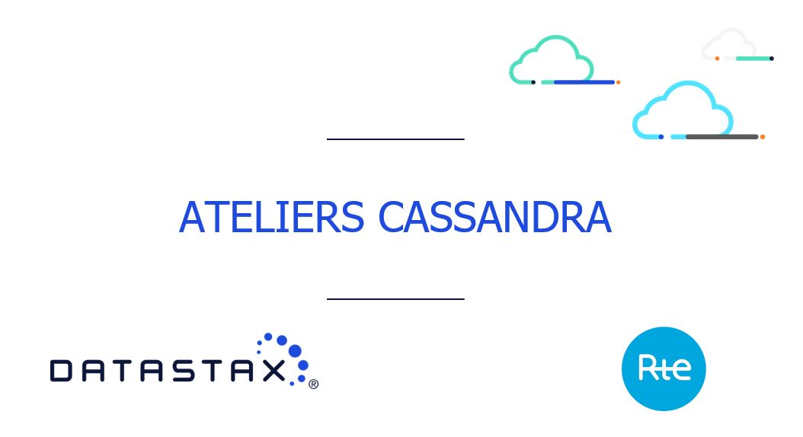

Bienvenue aux Ateliers DataStax RTE
======================================================

Dans ce repo, vous trouverez tout ce dont vous avez besoin pour ces Ateliers DataStax RTE
- les présentations
- les exercices
Ajoutez cette page à vos bookmarks pour les prochains exercices!

## Available Materials

| Titre  | Description
|---|---|
| **Introduction** | TBA |
| **Code Source** | TBA |
| **Presentation** | [Voici les Slides](https://github.com/DataStax-Academy/cassandra-workshop-online/tree/master/slides/presentation.pdf)  |

## Exercises

| Title  | Description
|---|---|
| **0 - Bootstraper votre environnement** | Suivez les instructions [ICI](https://github.com/DataStax-Academy/cassandra-workshop-online/blob/master/exercises/0_-_Bootstraping.md), pour comprendre comment nous allons travailler  |
| **1 - Créez votre Instance Astra** | Suivez les instructions [ICI](https://github.com/DataStax-Academy/cassandra-workshop-online/blob/master/exercises/1_-_Create_Astra_Instance.md) pour vous logger à Astra et créer votre première instance  |
| **2 -  DataStax Studio** | Uploadez le notebook [2_-_Datastax_Studio.tar](https://github.com/DataStax-Academy/cassandra-workshop-online/tree/master/notebooks/2_-_Datastax_Studio.tar) dans DataStax Studio et suivez les instructions  |
| **3 - Le CQL** | Upload the notebook [3_-_Working_with_CQL.tar](https://github.com/DataStax-Academy/cassandra-workshop-online/tree/master/notebooks/3_-_Working_with_CQL.tar) dans DataStax Studio et suivez les instructions  |
| **4 - Data Modelling** | Upload the notebook [4_-_Data_Modelling.tar](https://github.com/DataStax-Academy/cassandra-workshop-online/tree/master/notebooks/4_-_Data_Modelling.tar) dans DataStax Studio et suivez les instructions  |
| **5 - Advanced Data type** | Upload the notebook [5_-_Advanced_Data_Type.tar](https://github.com/DataStax-Academy/cassandra-workshop-online/tree/master/notebooks/5_-_Advanced_Data_Type.tar) dans DataStax Studio et suivez les instructions  |
| **6 - LWT et les Batches** | Upload the notebook [6_-_Lwt_and_Batches.tar](https://github.com/DataStax-Academy/cassandra-workshop-online/tree/master/notebooks/6_-_Lwt_and_Batches.tar) dans DataStax Studio et suivez les instructions  |

Enjoy !
